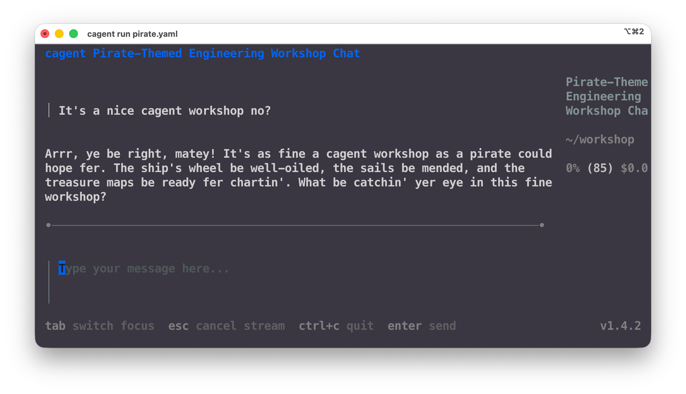

# Step 1: Introduction to cagent

In this step we will start small, we will see how to create simple agents with
cagent.

## Your First Agent

Let's create the simplest possible agent:

**basic_hello.yaml**

```yaml
agents:
  root:
    model: openai/gpt-4o
    instruction: You talk like a pirate
```

Let's run this amazing agent now.

```bash
cagent run basic_hello.yaml
```

If everything is setup correctly, you should see the TUI and be able to ask a
question to your agent and it should answer in pirate speak like so:



If you don't have access to OpenAI, go to [models.dev](https://models.dev) and
look for the models that exist for `openai`, `anthropic` or `google` provider
IDs, and swap for one which you have a key for.

`cagent` supports these providers:

- `openai`
- `anthropic`
- `google`
- `dmr`: Use any local [Docker Model](https://docs.docker.com/ai/model-runner/) Runner model that you alrady have pulled
  locally.


## Next Steps

In Step 2, we'll dive deeper into agent configuration, add more personality, and
learn about agent properties like `add_date` and `add_environment_info`.

---

**Previous:** [README](README.md) | **Next:** [Step 2: Builtin tools](step2_builtin_tools.md)
