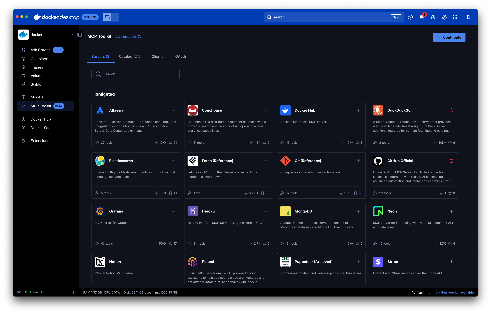

# Step 3: MCP (Model Context Protocol)

[MCP](https://modelcontextprotocol.io/) is an open-source standard for
connecting AI applications to external systems.

MCP is a standardised protocol clients can use to give an agent access to
different MCP servers that contain tools (and much more, we encourage you to go
and read the specification).

The Docker MCP Toolkit is a gateway that lets you set up, manage, and run
containerized MCP servers and connect them to AI agents.



Naturally, `cagent` makes it easy to use an MCP server from the MCP Toolkit.

Here is an example agent that uses the `fetch` MCP server from the toolkit.

```yaml
version: "2"

agents:
  root:
    model: openai/gpt-4o
    instruction: Summarize URLs for users
    toolsets:
      - type: mcp
        ref: docker:fetch
```

Run this agent and ask it "fetch rumpl.dev", you will see the agent calling the
`fetch` tool form the `fetch` MCP server.

This is the simplest way to use an MCP server with cagent, but you can also run
_any_ MCP server, local or remote.

## Custom local MCP server

```yaml
version: "2"
agents:
  root:
    model: opeani/gpt-4o
    add_date: true
    instruction: |
      Analyse the given stock
      Use tables to display the data
    toolsets:
      - type: mcp
      command: uvx
      args: ["yfmcp"]
```

## Remote MCP server

```yaml
version: "2"

agents:
  root:
    model: anthropic/claude-3-5-sonnet-latest
    description: Moby Project Expert
    instruction: You are an AI assistant with expertise in the moby/moby project's documentation.
    toolsets:
      - type: mcp
        remote:
          url: https://gitmcp.io/moby/moby
          transport_type: streamable
```

## Your own MCP server

In this exercice we will take an existing (very simple) MCP server, build it,
and then use it in our agent.

First clone https://github.com/rumpl/mcp-strawberry

You can then build the docker image of this server:

```console
$ git clone https://github.com/rumpl/mcp-strawberry
$ cd mcp-strawberry
$ docker build -t mcp-strawberry .
```

Now create an agent that will use this MCP server.

<details>
<summary>Hint 1</summary>

To run any server, use

```yaml
toolsets:
  - type: mcp
    command: ...
    args: [..., ...]
```

</details>

<details>
<summary>Hint 2</summary>

Make sure to add the `-i` and `--rm` flags when running your server

</details>

<details>
<summary>Solution</summary>

```yaml
version: "2"

agents:
  root:
    model: openai/gpt-4o
    instruction: Count the number of 'r' in a word
    toolsets:
      - type: mcp
        command: docker
        args: [run, "-i", "--rm", "mcp-strawberry"]
```

</details>

## Our developer agent

Let's use the power of MCP servers to make our agent even more powerful.

A good developer always reads the documentation (right?, right?). So let's give
our developer the capability to fetch up-to-date documentation for pretty much
any library out there. For this we will use the
[context7](https://context7.com/) MCP server. Luckily for us, this server is
already present in Dockers' MCP Toolkit.

```diff
version: "2"

agents:
  root:
    model: openai/gpt-4o
    instruction: You are an amazing developer
    add_environment_info: true
    add_date: true
    toolsets:
      - type: todo
      - type: shell
      - type: filesystem
+      - type: mcp
+        ref: docker:context7
```

Run this agent and ask this:

```
Create a directory "server" and in there write a server in node and typescirpt, the server should be a key-value store, use context7 to get the documentation you need for the server library you will use
```

Running this, the agent should use the context7 tools to find the appropriate
documentation for the library it chose to use to write this server.

Look around the MCP Toolkit, play with some more MCP servers, what other servers
do you think could be useful for a developer agent?
